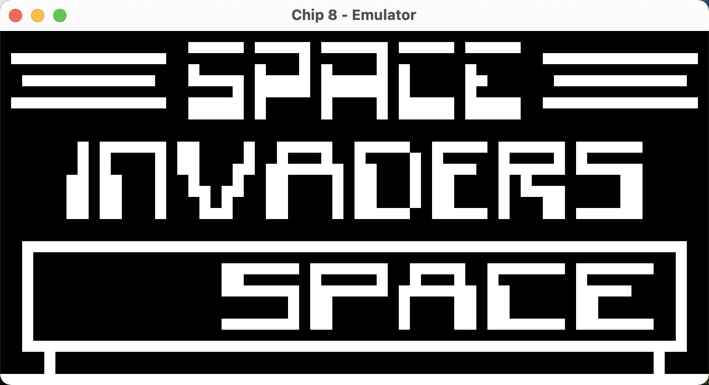

# rusty-chip8



This a simple chip8 emulator written in the <a href="https://www.rust-lang.org/">Rust programming language</a>. Building an emulator like this one gives you a great feeling of how home computers worked back in the late 70s. It's a nice challenge for people that they want to build something fun and complex at the same time.

## Resources
The following resources help you understand the chip8 architecture.

- <a href="http://devernay.free.fr/hacks/chip8/C8TECH10.HTM">Cowgod's Chip-8 Technical Reference</a>
- <a href="https://tobiasvl.github.io/blog/write-a-chip-8-emulator/">Guide to making a CHIP-8 emulator - Tobias V. Langhoff</a>

## Usage
Clone the repository and then:

```sh
cargo run -- <path-to-chip8-program>
```

You can find and download chip8 programs, games, etc <a href="https://github.com/kripod/chip8-roms">here</a>.
